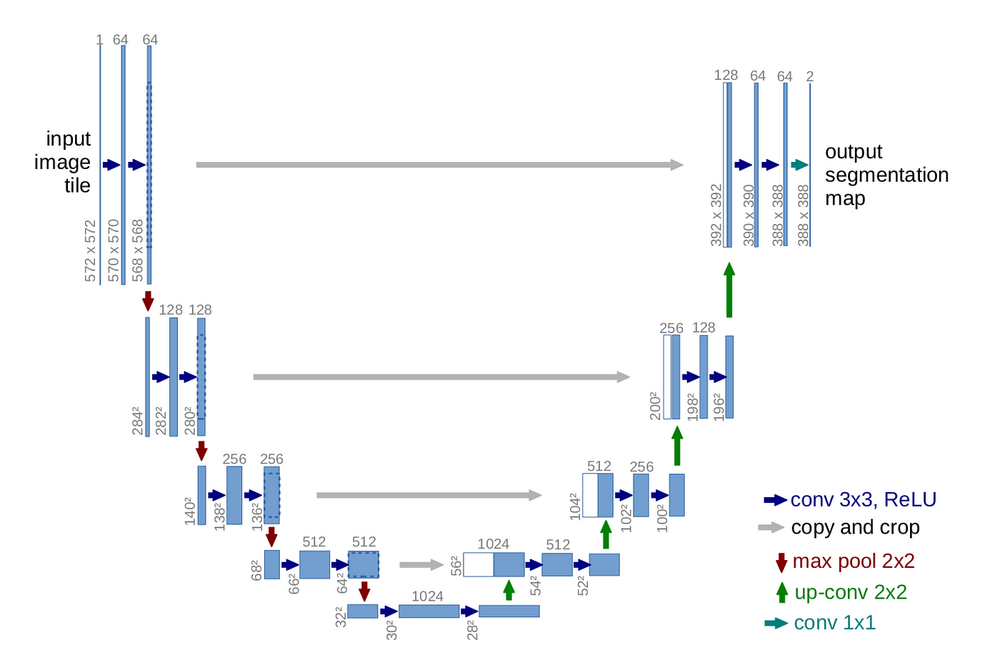
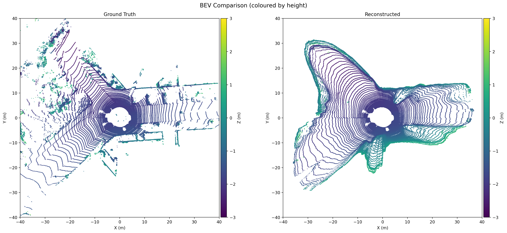
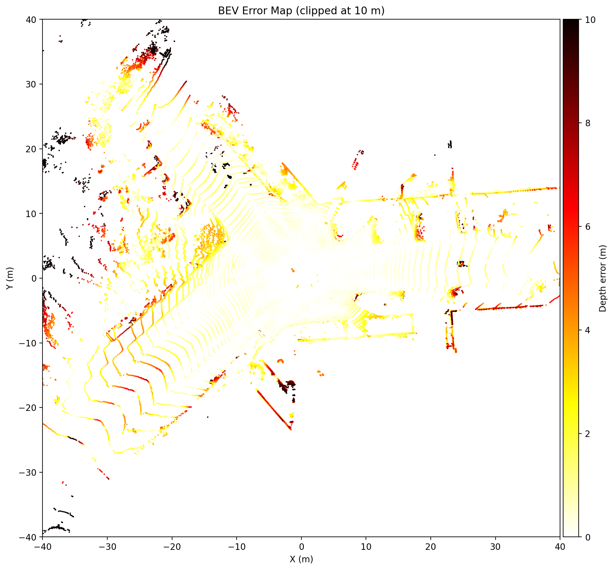
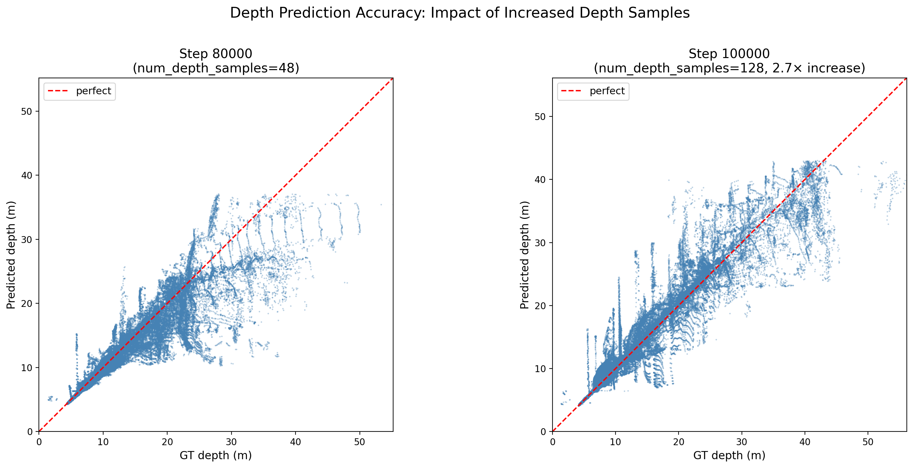
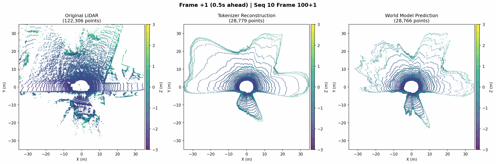
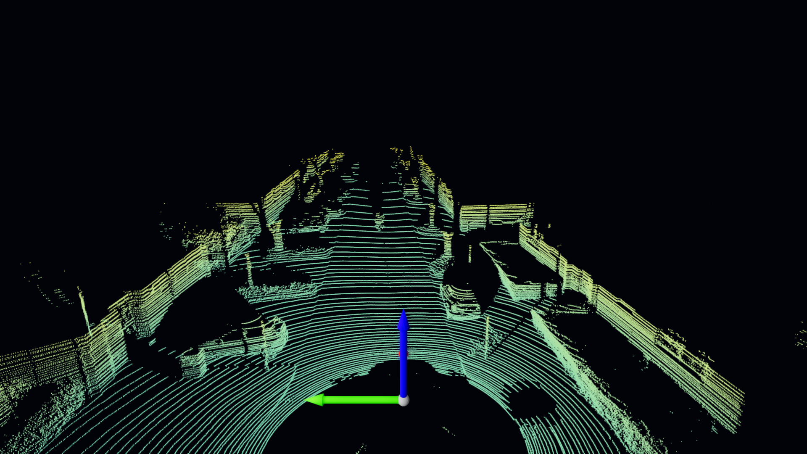
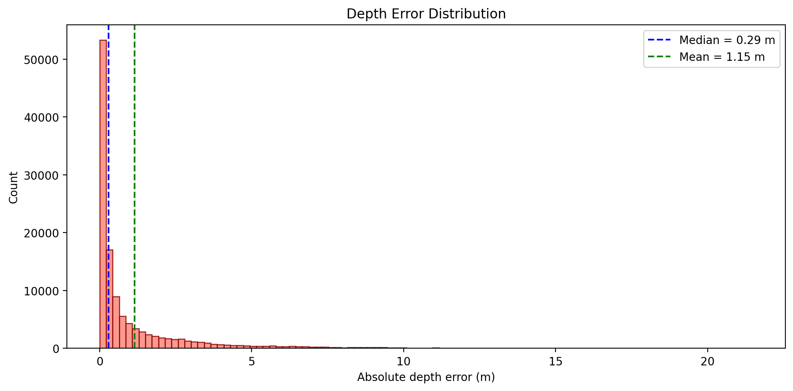

# Implemented U-NET ARCHITECTURE

# Tokenizer error map comparison

## BEV COMPARISON 

## TOKENIZER BEV ERROR MAP- RECONSTRUCTION

## DEPTH_SCATTER_COMPARISON

## GIF COMPARISON 10 SEC SEQUENCE- GROUND TRUTH - TOKENIZER - WORLD MODEL

## LIDAR CAMERA OVERLAY

## KITTI 3D FRONT

## ERROR HISTOGRAM

# Model Checkpoints

Pre-trained model checkpoints are available on [Hugging Face](https://huggingface.co/sangramrout/CoPilot4D).

## Tokenizer

The tokenizer checkpoint is saved at step 100,000, which showed the best reconstruction performance.

**Download:** [tokenizer/checkpoint_step_100000.pt](https://huggingface.co/sangramrout/CoPilot4D/blob/main/tokenizer/checkpoint_step_100000.pt)

### Checkpoint Comparison

| Checkpoint | MAE (m) | RMSE (m) | < 1m (%) | VQ Perplexity |
|------------|---------|----------|----------|---------------|
| Step 100,000 | 1.15 | 2.37 | 72.17% | 159.23 |
| Step 110,000 | 3.61 | 4.66 | 2.59% | 145.19 |
| Step 120,000 | 3.45 | 4.35 | 2.37% | 140.94 |
| Step 130,000 | 3.38 | 4.31 | 2.89% | 141.39 |

**Selected:** Step 100,000 - Best depth reconstruction accuracy with 72.17% of points within 1m error.

## World Model

The world model checkpoint is saved at step 50,000 (final checkpoint after full training).

**Download:** [world_model/checkpoint_step_50000.pt](https://huggingface.co/sangramrout/CoPilot4D/blob/main/world_model/checkpoint_step_50000.pt)

### Checkpoint Comparison

| Checkpoint | Step | Val Acc | Val Loss |
|------------|------|---------|----------|
| checkpoint_0046000.pt | 46,000 | 83.47% | 1.4996 |
| checkpoint_0048000.pt | 48,000 | 80.74% | 1.6320 |
| **checkpoint_0050000.pt (final)** | **50,000** | **84.32%** | **1.4603** |
| checkpoint_latest.pt | 50,000 | same | same |

**Selected:** Step 50,000 - Final trained model with best validation accuracy of 84.32%.

---

# MNIST DATA VALIDATION

